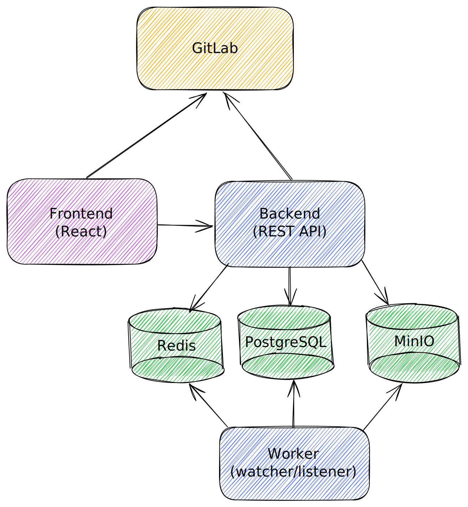

# Helm chart for R2Devops

This Helm chart will install [R2Devops](https://r2devops.io/) on a Kubernetes cluster.

## Quickstart

```bash
# creates a secret for the registry (ref. https://kubernetes.io/docs/tasks/configure-pod-container/pull-image-private-registry/)
kubectl create ns r2devops
kubectl create secret docker-registry r2devops-registry --docker-server=registry.gitlab.com/r2devops --docker-username=r2devops-user --docker-password=<token> -n r2devops

# helm repo add #### TODO

# installs with default parameters
helm upgrade --install r2devops ####/r2devops --create-namespace \
  --namespace r2devops

# checks all pods are running after some time
kubectl get pod -n r2devops
```

## Design



R2Devops relies on the following components:

* [Kratos](https://www.ory.sh/kratos/)
* [MinIO](https://min.io/)
* [Redis](https://redis.io/)
* [PostgreSQL](https://www.postgresql.org/)

## Going further

* [Contributing](CONTIBUTING.md)
