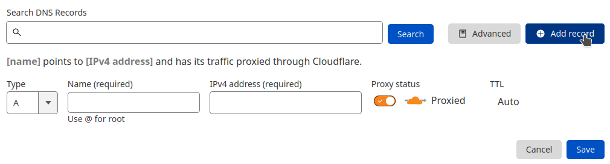
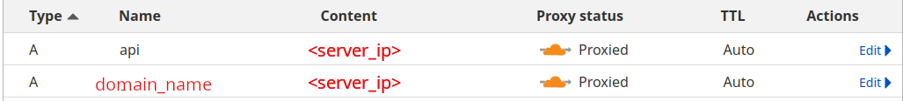

# Configuration

Great, you just finished to setup your server !

There are a few further steps to accomplish to get the self-hosted instance working.


### Domain name

To access the frontend, you will have to type an URL inside your browser. To performs this, you will need to associate this URL with a Domain Name thanks to DNS Records.

So you must own a Domain name and be able to configure DNS records to access your instance. 

*If you have already one, you can skip this step an go to the [dns](#dns) section.*

Otherwise, your company should have at least one Domain Name if you have an online website.
If you don't know where to find access to modify it, you should ask your administrator.

 Once you have the information, you can move to the next step 😀

??? example "Performs test with a free domain name"
    If you want to test the self-hosted behavior, without modifying the internal DNS of your company, you could use a free domain name from [Freenom](https://www.freenom.com/en/index.html?lang=en) or [No-IP](https://www.noip.com/).


### DNS Records

#### About records

The application needs two DNS records to work properly:

* One for the frontend, which is the main URL of the application and the one you will use to access it.
* One for the backend, which is the URL of the API.

By default the frontend URL is configured for `https://<your-domain-name>` and the backend URL to `https://api.<your-domain-name>`.

For example, if you own the domain name `mydomain.com`, the frontend URL will be `https://mydomain.com` and the backend URL will be `https://api.mydomain.com`.

!!! info "About our infra"
    On our side, we use [Cloudflare](https://www.cloudflare.com/) to manage our DNS records.
    You can access our application, [r2devops.io](https://r2devops.io), through the frontend URL `https://r2devops.io` and the backend URL `https://api.r2devops.io`.

#### Create records 

To start, you need to create two DNS records for your domain name.


Here are the two records you need to create:

1. A record for the frontend URL
    * Name: `@` or `<domain-name>` *Replace the domain name by it's value*
    * Type: `A`
    * Value: `<your-server-ip>`

2. A record for the backend URL
    * Name: `api`
    * Type: `A`
    * Value: `<your-server-ip>`

!!! tip "Retrieve your server IP"
    You can retrieve your server IP by running the following command:
    ```bash
    curl ifconfig.me
    ```

##### Example

For example on Cloudflare, you can add them easily by clicking on the `DNS` tab and then on the `Add record` button.



Then you can add a new DNS twice by filling the form with the values from the previous [section](/configuration-domain/#create-records).

Finally, you should have something like this : 



*Depending on your DNS provider, the process to create the DNS records may differ. Please refer to their documentation for more information.*

### Update the configuration

Once you're done, change the `local.env` file to match your domain name.

```bash
DOMAIN_NAME="r2devops.<domain-name>"
```

If you need custom URLs for the frontend and the backend, you can check the [customization](/customization/#customization) section.


Now we have to configure the Authentication 🔐.