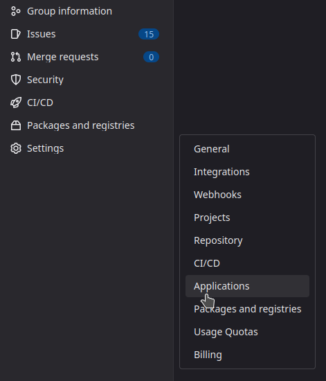
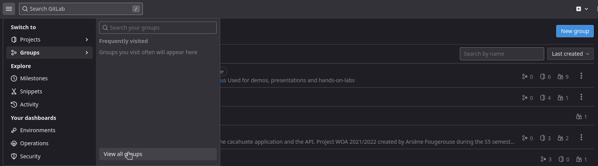
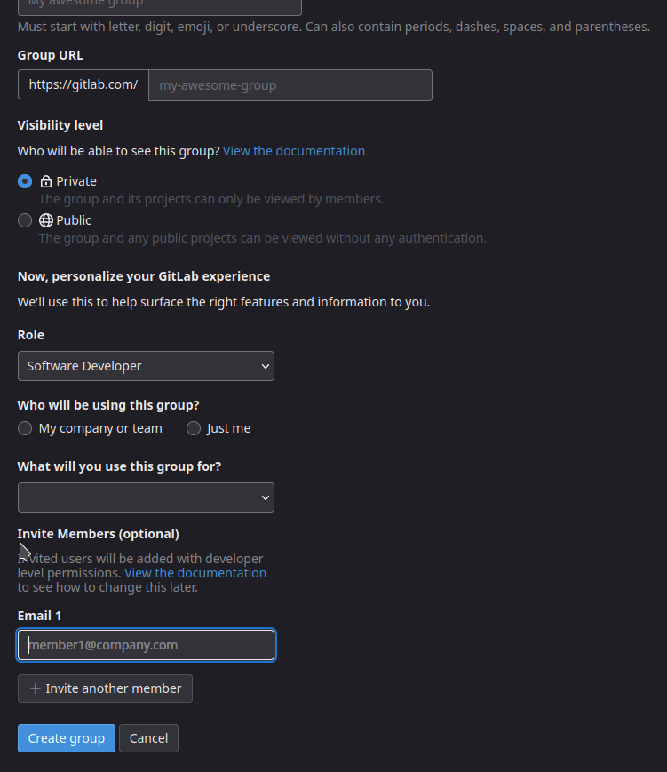
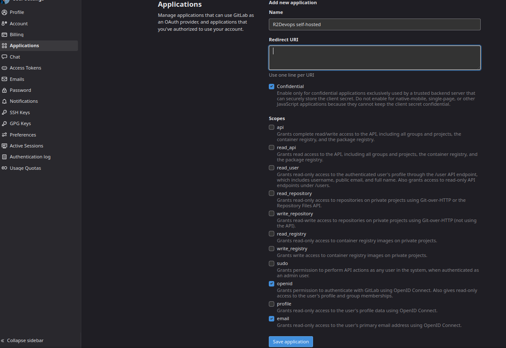
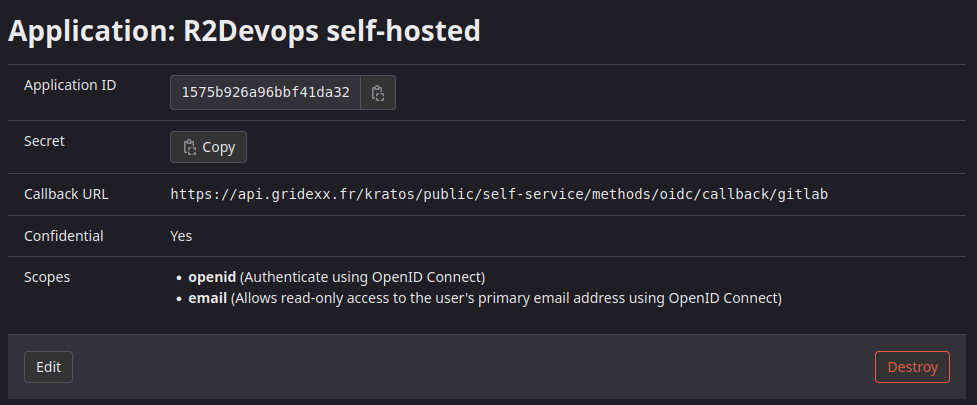

# Configuration

### GitLab OIDC 🦊

We are using GitLab as an OIDC (OpenID Connect) provider to authenticate users. It means that user will be able to login to R2Devops using their GitLab account.

To do so, you need to create a new application in your GitLab account.

#### Create an application


If you have a group, search for it inside the Group menu and then on the sidebar navigate through `Settings > Applications`. 



??? info "Create a group for your company"
    If you don't have a common group with your colleagues on GitLab, it is recommended to create one.

    👉 As this application may be managed by other people of your team, it makes sense to share access to the OIDC access with other.

    1. Creating a group can be done, inside the menu bar by clicking on  `View all groups` and then press the blue `New Group` button. 
    
    2. Then create the group by filling the form with information.
    {width=400}

    *Don't forget to invite members with their email addresses.* 



Complete with the following information :  

* Name: `R2Devops self-hosted`  
* Redirect URI : `https://<API_URL>/kratos/public/self-service/methods/oidc/callback/gitlab`  
- [x] confidential
* Scopes: `openid, email`  

And click on `Create Application`.

!!! info "API_URL"
    The API_URL is the URL of your self-hosted R2Devops' API. The value should be coherent with the content of the variable `API_URL` in the `local.env`.

Now you should see the following screen:



#### Update the configuration

Copy the `Application ID` and the `Secret` and paste them in the `kratos.yml` file under the GitLab provider section :

```yaml title="kratos.yml" hl_lines="15 16"
  methods:
    link:
      enabled: true
    profile:
      enabled: true
    password:
      enabled: true
    oidc:
      enabled: true
      config:
        providers:
          - id: gitlab # this is `<provider-id>` in the Authorization callback URL. DO NOT CHANGE IT ONCE SET!
            provider: gitlab
            # TODO : Paste your Application ID and Application secret here :
            client_id: #Application ID
            client_secret: #Secret
            mapper_url: file:///etc/config/kratos/oidc.gitlab.jsonnet
            scope:
              - openid
              - email
```


Now let's configure our SMTP server to send emails to users 📨